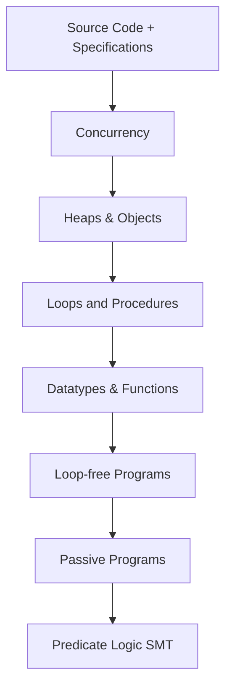

> [!summary] 
> • $\IVL{0}$: First intermediate verification language
> 
> • Key architectural aspects:
>   - Multi-layer structure (like compilers)
>   - Higher-layer tasks → lower-layer encoding → SMT solving
>   - Split verification conditions for localized failure detection
> 
> • Features:
>   - Custom type declarations
>   - Function definitions
>   - Integration with Viper infrastructure

# Verification Methodologies - Exam Notes

## Core Components of Building an Automated Verifier

Inference rules determining execution relation

![[inference rules for execution relations.png]]

### 1. Key Components (Flow)
> [!info] Main Components
> - **Verification Problem** → **Formalization** → **Methodology** → **Automation**
> - Each step builds on the previous, creating a verification stack

### 2. Verification Stack Architecture


### 3. Key Concepts in IVL₀

> [!important] Core IVL₀ Commands
> - `Assert{f}` - Checks if formula holds, aborts if false
> - `Assume{f}` - Checks formula, discards execution if false
> - `c₁;c₂` - Sequential composition
> - `{c₁}[]{c₂}` - Nondeterministic choice

### 4. Correctness Types

> [!note] Three Types of Correctness:
> 1. **Functional Correctness**: Program respects pre/post conditions (unsuccessful termination does not matter)
> 2. **Safety**: No execution aborts with error
> 3. **Valid**: Both safe AND functionally correct

## Exam Tips for This Topic

Based on the exam guidelines:

1. **Know Your Code**:
   - Be prepared to explain verification rules and how they work
   - Understand why certain code verifies or doesn't verify
   - Be able to identify unsound encodings

2. **Key Areas to Focus**:
   ```markdown
   - Weakest precondition calculations
   - Program logic rules and their application
   - Sound vs unsound verification techniques
   - Error localization strategies
   ```

3. **Example Question Types**:
   > [!example] Common Questions
   > - Explain why a verification technique is sound/complete
   > - Analyze piece of Viper code
   > - Debug verification failures
   > - Design verification encoding for new construct

4. **Practical Skills**:
   - Practice working with Viper
   - Know how to encode verification problems
   - Understand error messages and debugging

## Common Pitfalls to Avoid

> [!warning] Watch Out For
> - Unsatisfiable axiom systems leading to unsoundness
> - Masked verification errors
> - Incorrect handling of nondeterministic choice
> - Missing safety checks

I'll create a comprehensive reference section for the mathematical foundations.

# Mathematical Reference

## Metavariables
| Variable | Meaning |
|----------|----------|
| $n,m$ | natural numbers |
| $\x,\y,\z$ | variables |
| $\cc$ | $\IVL{0}$ commands |
| $\Signature$, $\Sorts$, $\Functions$, $\Relations$ | fixed signature, sets of sorts and symbols |
| $\fun$, $\rel$ | function and relation symbols |
| $\TT$ | types (sorts) |
| $\AX$ | fixed axiom system |
| $\Structure$ | fixed structure satisfying $\AX$ |
| $\ff,\fg,\fh$ | $\Signature$-formulae |
| $\mem$ | memories (program states) |

## Definitions

### Definition 3.1: Syntax of $\IVL{0}$ Commands
The set $\Commands$ of $\IVL{0}$ commands is given by:
$$\begin{align*}
\cc \qq{\EBNF} &
\Assert{\ff} 
\\ \qq{|} & 
\Assume{\ff}
\\ \qq{|} & 
\cc\Seq\cc
\\ \qq{|} & 
\Begin\cc\End\Choice\Begin\cc\End
\end{align*}$$

### Definition 3.2: Memories
The set $\Mems$ of memories is given by:
$$\Mems \defqeq \SetComp{\mem}{ \mem\colon \Vars \to \Universe \tand \tforall \tof{\x}{\TT}, \mem(\x) \in \UniverseOf{\TT} }$$

### Definition 3.3: Functional Correctness
A Floyd-Hoare triple $\Triple{\Pre}{\cc}{\Post}$ is functionally correct if and only if:
$$\tif \tuple{\cc\tsep\mem} \opSteps \tuple{\Done\tsep\mem'} \qq{\tthen} \tuple{\Structure,\mem'} \Satisfies \Post$$
for all memories $\mem$ and $\mem'$ with $\tuple{\Structure,\mem} \Satisfies \Pre$

### Definition 3.4: Safety
A Floyd-Hoare triple $\Triple{\Pre}{\cc}{\Post}$ is safe if and only if:
$$\tif \tuple{\Structure,\mem} \Satisfies \Pre \tthen \tuple{\cc\tsep\mem} \opNotSteps \tuple{\Abort\tsep\mem'}$$
for all memories $\mem$, $\mem'$

### Definition 3.5: Weakest Precondition
$\wp{\cc}{\Post}$ is defined inductively:
- $\wp{\Assert{\ff}}{\Post} = \ff \And \Post$
- $\wp{\Assume{\ff}}{\Post} = \ff \Implies \Post$
- $\wp{\cc_1\Seq\cc_2}{\Post} = \wp{\cc_1}{\wp{\cc_2}{\Post}}$
- $\wp{\Begin\cc_1\End\Choice\Begin\cc_2\End}{\Post} = \wp{\cc_1}{\Post} \And \wp{\cc_2}{\Post}$

## Theorems

### Theorem 3.1: Soundness
For all $\IVL{0}$ commands $\cc$ and $\Pre$, $\Post$:
$$\JudgeSyn \Triple{\Pre}{\cc}{\Post} \qimplies \JudgeSem \Triple{\Pre}{\cc}{\Post}$$

### Theorem 3.2: Weakest Precondition vs Set-based WP
$$\wp{\cc}{\True} \qeq \bigwedge_{\fg \in \swp{\cc}{\emptyset}} \fg$$

## Program Logic Rules

1. Assert Rule:
   $$\begin{prooftree}
   \AxiomC{}
   \RightLabel{assert}
   \UnaryInfC{$\JudgeSyn \Triple{\Pre \And \fh}{\Assert{\fh}}{\Pre}$}
   \end{prooftree}$$

2. Assume Rule:
   $$\begin{prooftree}
   \AxiomC{}
   \RightLabel{assume}
   \UnaryInfC{$\JudgeSyn \Triple{\Pre}{\Assume{\fh}}{\Pre \And \fh}$}
   \end{prooftree}$$

3. Consequence Rule:
   $$\begin{prooftree}
   \AxiomC{$\Pre \EntailsAX \Pre'$}
   \AxiomC{$\JudgeSyn \Triple{\Pre'}{\cc}{\Post'}$}
   \AxiomC{$\Post' \EntailsAX \Post$}
   \RightLabel{consequence}
   \TrinaryInfC{$\JudgeSyn \Triple{\Pre}{\cc}{\Post}$}
   \end{prooftree}$$

4. Sequence Rule:
   $$\begin{prooftree}
   \AxiomC{$\JudgeSyn \Triple{\Pre}{\cc_1}{\Intermediate}$}
   \AxiomC{$\JudgeSyn \Triple{\Intermediate}{\cc_2}{\Post}$}
   \RightLabel{sequence}
   \BinaryInfC{$\JudgeSyn \Triple{\Pre}{\cc_1\Seq\cc_2}{\Post}$}
   \end{prooftree}$$

5. Choice Rule:
   $$\begin{prooftree}
   \AxiomC{$\JudgeSyn \Triple{\Pre}{\cc_1}{\Post}$}
   \AxiomC{$\JudgeSyn \Triple{\Pre}{\cc_2}{\Post}$}
   \RightLabel{choice}
   \BinaryInfC{$\JudgeSyn \Triple{\Pre}{\Begin\cc_1\End\Choice\Begin\cc_2\End}{\Post}$}
   \end{prooftree}$$

