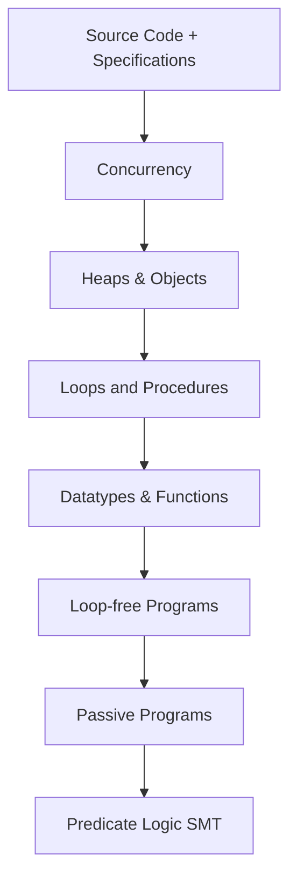

> [!summary] 
> • $\IVL{0}$: First intermediate verification language
> 
> • Key architectural aspects:
>   - Multi-layer structure (like compilers)
>   - Higher-layer tasks → lower-layer encoding → SMT solving
>   - Split verification conditions for localized failure detection
> 
> • Features:
>   - Custom type declarations
>   - Function definitions
>   - Integration with Viper infrastructure

# Verification Methodologies - Exam Notes

## Core Components of Building an Automated Verifier

Inference rules determining execution relation

![[inference rules for execution relations.png]]

### 1. Key Components (Flow)
> [!info] Main Components
> - **Verification Problem** → **Formalization** → **Methodology** → **Automation**
> - Each step builds on the previous, creating a verification stack

### 2. Verification Stack Architecture


### 3. Key Concepts in IVL₀

> [!important] Core IVL₀ Commands
> - `Assert{f}` - Checks if formula holds, aborts if false
> - `Assume{f}` - Checks formula, discards execution if false
> - `c₁;c₂` - Sequential composition
> - `{c₁}[]{c₂}` - Nondeterministic choice

### 4. Correctness Types

> [!note] Three Types of Correctness:
> 1. **Functional Correctness**: Program respects pre/post conditions (unsuccessful termination does not matter)
> 2. **Safety**: No execution aborts with error
> 3. **Valid**: Both safe AND functionally correct

## Exam Tips for This Topic

Based on the exam guidelines:

1. **Know Your Code**:
   - Be prepared to explain verification rules and how they work
   - Understand why certain code verifies or doesn't verify
   - Be able to identify unsound encodings

2. **Key Areas to Focus**:
   ```markdown
   - Weakest precondition calculations
   - Program logic rules and their application
   - Sound vs unsound verification techniques
   - Error localization strategies
   ```

3. **Example Question Types**:
   > [!example] Common Questions
   > - Explain why a verification technique is sound/complete
   > - Analyze piece of Viper code
   > - Debug verification failures
   > - Design verification encoding for new construct

4. **Practical Skills**:
   - Practice working with Viper
   - Know how to encode verification problems
   - Understand error messages and debugging

## Common Pitfalls to Avoid

> [!warning] Watch Out For
> - Unsatisfiable axiom systems leading to unsoundness
> - Masked verification errors
> - Incorrect handling of nondeterministic choice
> - Missing safety checks

I'll create a comprehensive reference section for the mathematical foundations.

# Mathematical Reference

## Metavariables
| Variable | Meaning |
|----------|----------|
| $n,m$ | natural numbers |
| $\x,\y,\z$ | variables |
| $\cc$ | $\IVL{0}$ commands |
| $\Signature$, $\Sorts$, $\Functions$, $\Relations$ | fixed signature, sets of sorts and symbols |
| $\fun$, $\rel$ | function and relation symbols |
| $\TT$ | types (sorts) |
| $\AX$ | fixed axiom system |
| $\Structure$ | fixed structure satisfying $\AX$ |
| $\ff,\fg,\fh$ | $\Signature$-formulae |
| $\mem$ | memories (program states) |

## Definitions

### Definition 3.1: Syntax of $\IVL{0}$ Commands
The set $\Commands$ of $\IVL{0}$ commands is given by:
$$\begin{align*}
\cc \qq{\EBNF} &
\Assert{\ff} 
\\ \qq{|} & 
\Assume{\ff}
\\ \qq{|} & 
\cc\Seq\cc
\\ \qq{|} & 
\Begin\cc\End\Choice\Begin\cc\End
\end{align*}$$

### Definition 3.2: Memories
The set $\Mems$ of memories is given by:
$$\Mems \defqeq \SetComp{\mem}{ \mem\colon \Vars \to \Universe \tand \tforall \tof{\x}{\TT}, \mem(\x) \in \UniverseOf{\TT} }$$

### Definition 3.3: Functional Correctness
A Floyd-Hoare triple $\Triple{\Pre}{\cc}{\Post}$ is functionally correct if and only if:
$$\tif \tuple{\cc\tsep\mem} \opSteps \tuple{\Done\tsep\mem'} \qq{\tthen} \tuple{\Structure,\mem'} \Satisfies \Post$$
for all memories $\mem$ and $\mem'$ with $\tuple{\Structure,\mem} \Satisfies \Pre$

### Definition 3.4: Safety
A Floyd-Hoare triple $\Triple{\Pre}{\cc}{\Post}$ is safe if and only if:
$$\tif \tuple{\Structure,\mem} \Satisfies \Pre \tthen \tuple{\cc\tsep\mem} \opNotSteps \tuple{\Abort\tsep\mem'}$$
for all memories $\mem$, $\mem'$

### Definition 3.5: Weakest Precondition
$\wp{\cc}{\Post}$ is defined inductively:
- $\wp{\Assert{\ff}}{\Post} = \ff \And \Post$
- $\wp{\Assume{\ff}}{\Post} = \ff \Implies \Post$
- $\wp{\cc_1\Seq\cc_2}{\Post} = \wp{\cc_1}{\wp{\cc_2}{\Post}}$
- $\wp{\Begin\cc_1\End\Choice\Begin\cc_2\End}{\Post} = \wp{\cc_1}{\Post} \And \wp{\cc_2}{\Post}$

## Theorems

### Theorem 3.1: Soundness
For all $\IVL{0}$ commands $\cc$ and $\Pre$, $\Post$:
$$\JudgeSyn \Triple{\Pre}{\cc}{\Post} \qimplies \JudgeSem \Triple{\Pre}{\cc}{\Post}$$

### Theorem 3.2: Weakest Precondition vs Set-based WP
$$\wp{\cc}{\True} \qeq \bigwedge_{\fg \in \swp{\cc}{\emptyset}} \fg$$

## Program Logic Rules

1. Assert Rule:
   $$\begin{prooftree}
   \AxiomC{}
   \RightLabel{assert}
   \UnaryInfC{$\JudgeSyn \Triple{\Pre \And \fh}{\Assert{\fh}}{\Pre}$}
   \end{prooftree}$$

2. Assume Rule:
   $$\begin{prooftree}
   \AxiomC{}
   \RightLabel{assume}
   \UnaryInfC{$\JudgeSyn \Triple{\Pre}{\Assume{\fh}}{\Pre \And \fh}$}
   \end{prooftree}$$

3. Consequence Rule:
   $$\begin{prooftree}
   \AxiomC{$\Pre \EntailsAX \Pre'$}
   \AxiomC{$\JudgeSyn \Triple{\Pre'}{\cc}{\Post'}$}
   \AxiomC{$\Post' \EntailsAX \Post$}
   \RightLabel{consequence}
   \TrinaryInfC{$\JudgeSyn \Triple{\Pre}{\cc}{\Post}$}
   \end{prooftree}$$

4. Sequence Rule:
   $$\begin{prooftree}
   \AxiomC{$\JudgeSyn \Triple{\Pre}{\cc_1}{\Intermediate}$}
   \AxiomC{$\JudgeSyn \Triple{\Intermediate}{\cc_2}{\Post}$}
   \RightLabel{sequence}
   \BinaryInfC{$\JudgeSyn \Triple{\Pre}{\cc_1\Seq\cc_2}{\Post}$}
   \end{prooftree}$$

5. Choice Rule:
   $$\begin{prooftree}
   \AxiomC{$\JudgeSyn \Triple{\Pre}{\cc_1}{\Post}$}
   \AxiomC{$\JudgeSyn \Triple{\Pre}{\cc_2}{\Post}$}
   \RightLabel{choice}
   \BinaryInfC{$\JudgeSyn \Triple{\Pre}{\Begin\cc_1\End\Choice\Begin\cc_2\End}{\Post}$}
   \end{prooftree}$$


$$
% LaTeX commands converted from MathJax macros
% Generated automatically

% Formatting Commands
% ------------------------------------------------------------
\newcommand{\FunFont}[1]{\mathsf{#1}}
\newcommand{\LogicFont}[1]{\mathfrak{#1}}
\newcommand{\NonterminalFont}[1]{\textsf{#1}}
\newcommand{\PredFont}[1]{\mathit{#1}}
\newcommand{\SetFont}[1]{\textbf{#1}}
\newcommand{\SymbolFont}[1]{\textsf{#1}}
\newcommand{\ccFont}[1]{\texttt{#1}}

% Logic Operators
% ------------------------------------------------------------
\newcommand{\AbsEntails}{\models}
\newcommand{\And}{\mathbin{\wedge}}
\newcommand{\Entails}{\models}
\newcommand{\JudgeSem}{\models}
\newcommand{\Neg}{\neg}
\newcommand{\NotSatisfies}{\not\models}
\newcommand{\Or}{\mathbin{\vee}}
\newcommand{\Satisfies}{\models}
\newcommand{\Valid}{\models}
\newcommand{\aNeg}{${\color{blue!80}\Neg}$}
\newcommand{\valid}[1]{\models_{#1}}

% Other Commands
% ------------------------------------------------------------
\newcommand{\Abort}{\ccFont{abort}}
\newcommand{\Acquire}[1]{\ccFont{acquire}~#1}
\newcommand{\Ann}[1]{{\color{blue!80}\{\!\{~#1~\}\!\}}}
\newcommand{\AnnClose}[1]{{\color{blue!80}#1~\}\!\}}}
\newcommand{\AnnOpen}[1]{{\color{blue!80}\{\!\{~#1}}
\newcommand{\Assign}[2]{#1~\ccFont{:=}~#2}
\newcommand{\AssignField}[3]{\Assign{#1.#2}{#3}}
\newcommand{\Assume}[1]{\ccFont{assume}~#1}
\newcommand{\BTriple}[3]{{\color{black}\{\!\{~#1~\}\!\}}~#2~{\color{black}\{\!\{~#3~\}\!\}}}
\newcommand{\Begin}{\ccSymbol{\{}}
\newcommand{\BlockBegin}{\ccFont{begin}}
\newcommand{\BlockEnd}{\ccFont{end}}
\newcommand{\CCardinality}[1]{\ccSymbol{|}#1\ccSymbol{|}}
\newcommand{\CIn}{\ccFont{in}}
\newcommand{\CURRENT}{\Sidenote{\color{red}\textbf{CURRENT}} \section*{\color{red}CURRENT CURRENT CURRENT CURRENT CURRENT} }
\newcommand{\CUnion}{\ccFont{union}}
\newcommand{\Choice}{~\ccSymbol{[\,]}~}
\newcommand{\Clean}[1]{\textsf{clean}(#1)}
\newcommand{\Constant}{c}
\newcommand{\Context}{\textsf{ctx}}
\newcommand{\CurryFromTo}[2]{{#1 \to #2}}
\newcommand{\DeclDomain}{\NonterminalFont{dom}}
\newcommand{\DeclOptional}[1]{[#1]^{?}}
\newcommand{\DeclParams}[1]{\Sequence{#1\OfTypeSym\TT}}
\newcommand{\DeclStar}[1]{[#1]^{*}}
\newcommand{\Decreases}[1]{\ccFont{decreases}~#1}
\newcommand{\Def}[1]{\Defsym(#1)}
\newcommand{\Defsym}{\textsf{def}}
\newcommand{\Diverge}{\ccFont{diverge}}
\newcommand{\DomAxiom}{\ccFont{axiom}}
\newcommand{\Domain}{\ccFont{domain}}
\newcommand{\Done}{\ccFont{done}}
\newcommand{\EBNF}{\texttt{::=}}
\newcommand{\Else}{~\ccFont{else}~}
\newcommand{\Encode}[1]{\textsf{enc}(#1)}
\newcommand{\End}{\ccSymbol{\}}}
\newcommand{\Ensures}[1]{\ccFont{ensures}~#1}
\newcommand{\EntailsAX}{\SatisfiesMod{\AX}}
\newcommand{\EnvProc}{\Gamma}
\newcommand{\Equivalent}{\mathbin{\leftrightarrow}}
\newcommand{\Exhale}[1]{\ccFont{exhale}~#1}
\newcommand{\Exists}{\exists}
\newcommand{\False}{\texttt{false}}
\newcommand{\Fold}[1]{\ccFont{fold}~#1}
\newcommand{\Forall}{\forall}
\newcommand{\ForkThread}[1]{\ccFont{fork}~#1}
\newcommand{\Formula}{F}
\newcommand{\FormulaA}{G}
\newcommand{\FormulaB}{H}
\newcommand{\FormulaI}{I}
\newcommand{\FormulaSet}{\Phi}
\newcommand{\Free}[1]{\ccFont{free}~#1}
\newcommand{\Function}{\ccFont{function}}
\newcommand{\FunctionsFromTo}[2]{\left[#1 \to #2\right]}
\newcommand{\GenConsSymbol}{\SymbolFont{c}}
\newcommand{\GenFunSymbol}{\SymbolFont{f}}
\newcommand{\GenRelSymbol}{\SymbolFont{R}}
\newcommand{\GenSize}[1]{|#1|}
\newcommand{\GenSortSymbol}{\SymbolFont{S}}
\newcommand{\GetAssignedMeaning}{\LogicFont{a}}
\newcommand{\GetConstant}{\GetAssignedMeaning}
\newcommand{\GetFunction}{\GetAssignedMeaning}
\newcommand{\GetInterpretation}{\LogicFont{a}}
\newcommand{\GetRelation}{\GetAssignedMeaning}
\newcommand{\GetSort}{\FunFont{sort}}
\newcommand{\GetUniverse}{\LogicFont{u}}
\newcommand{\Havoc}[1]{\ccFont{havoc}~#1}
\newcommand{\IInterpreted}[2]{#1^{#2}}
\newcommand{\IVL}[1]{\text{IVL}#1}
\newcommand{\Ident}{\IdentifierFont{ident}}
\newcommand{\IdentFunction}{\IdentifierFont{fun}}
\newcommand{\IdentMethod}{\IdentifierFont{mthd}}
\newcommand{\IdentType}{\IdentifierFont{type}}
\newcommand{\Implies}{\mathbin{\rightarrow}}
\newcommand{\Inhale}[1]{\ccFont{inhale}~#1}
\newcommand{\Intermediate}{\FormulaB}
\newcommand{\Interpretation}{\LogicFont{I}}
\newcommand{\Interpreted}[1]{#1^{\Structure}}
\newcommand{\Inv}{\FormulaI}
\newcommand{\Ite}[3]{\ccFont{if}~\LPar#1\RPar~\Begin~#2~\End~\ccFont{else}~\Begin~#3~\End}
\newcommand{\JoinThread}[1]{\ccFont{join}~#1}
\newcommand{\JudgeFunctional}{\JudgeSem_{\markerFunctional}}
\newcommand{\JudgeSafe}{\JudgeSem_{\markerSafe}}
\newcommand{\JudgeSyn}{\vdash}
\newcommand{\JudgeSynSafe}{\JudgeSyn_{\markerSafe}}
\newcommand{\JudgeSynTotal}{\JudgeSyn_{\markerTotal}}
\newcommand{\JudgeTotal}{\JudgeSem_{\markerTotal}}
\newcommand{\LPar}{\ccSymbol{(}}
\newcommand{\LetIn}[2]{\ccFont{let}~\Assign{#1}{#2}~\ccFont{in}~}
\newcommand{\Local}[1]{\textsf{local}(#1)}
\newcommand{\Loop}{\ccFont{loop}}
\newcommand{\Magic}{\ccFont{magic}}
\newcommand{\Method}{\ccFont{method}}
\newcommand{\Mid}{\fh}
\newcommand{\New}[1]{\Assign{#1}{\ccFont{new}}}
\newcommand{\OfType}[2]{#1 \texttt{:} #2}
\newcommand{\OfTypeSym}{\ccSymbol{:}}
\newcommand{\Old}[1]{\ccSymbol{old(}#1\ccSymbol{)}}
\newcommand{\PLog}[1]{\LL{#1}}
\newcommand{\PP}{P}
\newcommand{\PPA}{P_1}
\newcommand{\PPB}{P_2}
\newcommand{\PPC}{P_3}
\newcommand{\Par}{~\ccSymbol{||}~}
\newcommand{\Post}{\fg}
\newcommand{\Pre}{\ff}
\newcommand{\PredicateCom}[2]{#1[#2]}
\newcommand{\PredicateTrans}[3]{#1[#2](#3)}
\newcommand{\RPar}{\ccSymbol{)}}
\newcommand{\ReadField}[3]{\Assign{#1}{#2.#3}}
\newcommand{\Release}[1]{\ccFont{release}~#1}
\newcommand{\RepeatUntil}[2]{\ccFont{repeat}~#1~\ccFont{until}~#2}
\newcommand{\Requires}[1]{\ccFont{requires}~#1}
\newcommand{\Result}{\ccFont{result}}
\newcommand{\Returns}{\ccFont{returns}}
\newcommand{\RuleName}[1]{\text{#1}}
\newcommand{\Sat}{\FunFont{sat}}
\newcommand{\SatisfiesAX}{\SatisfiesMod{\AX}}
\newcommand{\SatisfiesMod}[1]{\Satisfies_{#1}}
\newcommand{\Set}[1]{\left\{\,#1\,\right\}}
\newcommand{\SetComp}[2]{\left\{\,#1 ~\middle|~ #2 \,\right\}}
\newcommand{\SetPlus}[1]{{#1}^{+}}
\newcommand{\Signature}{\Sigma}
\newcommand{\Skip}{\ccFont{skip}}
\newcommand{\State}{\sigma}
\newcommand{\StatesOf}[1]{\States(#1)}
\newcommand{\Structure}{\LogicFont{A}}
\newcommand{\Subst}[2]{\subst{#1}{#2}}
\newcommand{\TODO}[1]{\Sidenote{\textbf{TODO:} #1}}
\newcommand{\TODOIN}[1]{\Sidenote{\textbf{TODO}}\paragraph{\textbf{TODO}.} #1}
\newcommand{\TT}{\texttt{T}}
\newcommand{\TTS}{\texttt{S}}
\newcommand{\TTSs}{\Sequence{\TTS}}
\newcommand{\TTs}{\Sequence{\TT}}
\newcommand{\Term}{t}
\newcommand{\TermA}{a}
\newcommand{\TermB}{b}
\newcommand{\TermC}{c}
\newcommand{\TermE}{\mathit{e}}
\newcommand{\TermI}{t_i}
\newcommand{\TermInt}{k}
\newcommand{\TermN}{t_n}
\newcommand{\TermP}{t'}
\newcommand{\TermX}{t_1}
\newcommand{\TermY}{t_2}
\newcommand{\TermZ}{t_3}
\newcommand{\Triple}[3]{{\color{blue!80}\{\!\{~#1~\}\!\}}~#2~{\color{blue!80}\{\!\{~#3~\}\!\}}}
\newcommand{\True}{\texttt{true}}
\newcommand{\Unfold}[1]{\ccFont{unfold}~#1}
\newcommand{\UniverseOf}[1]{\Universe(#1)}
\newcommand{\Unsat}{\FunFont{unsat}}
\newcommand{\ValidAX}{\SatisfiesMod{\AX}}
\newcommand{\aAnd}{${\color{blue!80}\And}$}
\newcommand{\aOr}{${\color{blue!80}\Or}$}
\newcommand{\aX}{X}
\newcommand{\aY}{Y}
\newcommand{\aZ}{Z}
\newcommand{\aaa}[1]{{\color{blue!80}#1}}
\newcommand{\acc}{A}
\newcommand{\aee}{\mathit{a}}
\newcommand{\aff}{\ff}
\newcommand{\afg}{\fg}
\newcommand{\afh}{\fh}
\newcommand{\aleq}{${\color{blue!80}\leq}$}
\newcommand{\aneq}{${\color{blue!80}\neq}$}
\newcommand{\arityOf}[2]{#1 / #2}
\newcommand{\bb}{b}
\newcommand{\cAnd}{${\color{orange}\And}$}
\newcommand{\cAssn}[1]{\Configurations\left(#1\right)}
\newcommand{\cConf}[1]{\Configurations(#1)}
\newcommand{\cInitial}{\I}
\newcommand{\cOr}{${\color{orange}\Or}$}
\newcommand{\cSafe}{\F}
\newcommand{\cSucc}[1]{\cSuccSym\left(#1\right)}
\newcommand{\cSuccs}[2]{\cSuccSym^{#1}\left(#2\right)}
\newcommand{\cc}{C}
\newcommand{\ccA}{C_1}
\newcommand{\ccB}{C_2}
\newcommand{\ccC}{C_3}
\newcommand{\ccSymbol}[1]{\mathtt{#1}}
\newcommand{\cleq}{${\color{orange}\leq}$}
\newcommand{\cneq}{${\color{orange}\neq}$}
\newcommand{\cnf}{c}
\newcommand{\conf}{\textsf{cnf}}
\newcommand{\confError}{\textsf{error}}
\newcommand{\confMagic}{\textsf{magic}}
\newcommand{\confTerm}{\textsf{done}}
\newcommand{\const}{c}
\newcommand{\constInt}{k}
\newcommand{\cxx}{\ccSymbol{x}}
\newcommand{\cxxA}{\ccSymbol{y}}
\newcommand{\cxxB}{\ccSymbol{z}}
\newcommand{\cxxC}{\ccSymbol{p}}
\newcommand{\cxxD}{\ccSymbol{q}}
\newcommand{\dd}{\NonterminalFont{D}}
\newcommand{\dda}{\NonterminalFont{A}}
\newcommand{\ddp}{\NonterminalFont{Spec}}
\newcommand{\ddr}{\NonterminalFont{R}}
\newcommand{\ddv}{\NonterminalFont{V}}
\newcommand{\defqeq}{\quad\defeq\quad}
\newcommand{\eX}{a}
\newcommand{\eY}{b}
\newcommand{\eZ}{c}
\newcommand{\ee}{\mathit{e}}
\newcommand{\eeq}{~=~}
\newcommand{\ees}{\Sequence{\ee}}
\newcommand{\empha}[1]{#1}
\newcommand{\emphb}[1]{#1}
\newcommand{\emphc}[1]{#1}
\newcommand{\emphd}[1]{#1}
\newcommand{\emptyWord}{\varepsilon}
\newcommand{\eq}{=}
\newcommand{\eval}[2]{\evalE{#1}(#2)}
\newcommand{\evalE}[1]{[#1]}
\newcommand{\fA}{\FunFont{A}}
\newcommand{\fB}{\FunFont{B}}
\newcommand{\fC}{\FunFont{C}}
\newcommand{\fS}{\FunFont{S}}
\newcommand{\false}{\texttt{false}}
\newcommand{\ff}{\PredFont{F}}
\newcommand{\fg}{\PredFont{G}}
\newcommand{\fh}{\PredFont{H}}
\newcommand{\field}{f}
\newcommand{\fun}{f}
\newcommand{\gfp}[1]{\text{gfp}\left(#1\right)}
\newcommand{\glb}{\text{glb}\,}
\newcommand{\gun}{g}
\newcommand{\highlight}[1]{{\color{blue}#1}}
\newcommand{\iUpdate}[2]{[#1 \leftarrow #2]}
\newcommand{\itema}{\item}
\newcommand{\itemb}{\item}
\newcommand{\itemc}{\item}
\newcommand{\itemu}{\item}
\newcommand{\itemv}{\item}
\newcommand{\itemw}{\item}
\newcommand{\known}[1]{{\color{black!30}#1}}
\newcommand{\lambdaExpr}[1]{\lambda #1\,.~}
\newcommand{\leval}[2]{\myllbracket #1 \myrrbracket(#2)}
\newcommand{\lfp}[1]{\textsf{lfp}\left(#1\right)}
\newcommand{\lock}{\ell}
\newcommand{\lub}{\textsf{lub}\,}
\newcommand{\mBody}{\FunFont{body}}
\newcommand{\mIn}{\FunFont{in}}
\newcommand{\mOut}{\FunFont{out}}
\newcommand{\mPost}{\FunFont{post}}
\newcommand{\mPre}{\FunFont{pre}}
\newcommand{\mUpdate}[2]{[#1 \leftarrow #2]}
\newcommand{\markerFunctional}{\text{f}}
\newcommand{\markerSafe}{\text{p}}
\newcommand{\markerTotal}{\text{t}}
\newcommand{\mem}{\mathfrak{m}}
\newcommand{\memph}[1]{\textit{#1}}
\newcommand{\mydot}{\colon}
\newcommand{\myllbracket}{[\!\![}
\newcommand{\myrrbracket}{]\!\!]}
\newcommand{\opNotSteps}{\not\opStep^{*}}
\newcommand{\opPost}[1]{\opPostSym\left(#1\right)}
\newcommand{\opPre}[1]{\opPreSym\left(#1\right)}
\newcommand{\opStep}{\Rightarrow}
\newcommand{\opSteps}{\opStep^{*}}
\newcommand{\opStepsN}[1]{\opStep^{#1}}
\newcommand{\pDeclare}[2]{#1~{\triangleright}~#2}
\newcommand{\pDivergence}{\PredFont{divergence}}
\newcommand{\pEnv}{D}
\newcommand{\pFunctional}[1]{\PredFont{functional}_{#1}}
\newcommand{\pPartial}{\PredFont{partial}}
\newcommand{\pSafe}[1]{\PredFont{safe}_{#1}}
\newcommand{\pSep}{~\,{::}\,~}
\newcommand{\pTotal}{\PredFont{total}}
\newcommand{\pValid}{\PredFont{valid}}
\newcommand{\peeq}{\eeq}
\newcommand{\peq}{\eq}
\newcommand{\powerset}[1]{2^{#1}}
\newcommand{\pp}{\varphi}
\newcommand{\ppA}{\psi}
\newcommand{\ppB}{\vartheta}
\newcommand{\pqeq}{\qeq}
\newcommand{\prAssign}{\CallAssign{\prX}{\proc}{\prE}}
\newcommand{\prBody}{\cc}
\newcommand{\prContext}{\Gamma}
\newcommand{\prDecl}{\prBody(\prIn)\colon \prOut}
\newcommand{\prDefault}{\_}
\newcommand{\prE}{\tupleName{\ee}}
\newcommand{\prEnv}{D}
\newcommand{\prIn}{\tupleName{in}}
\newcommand{\prOut}{\tupleName{out}}
\newcommand{\prX}{\tupleName{\x}}
\newcommand{\prY}{\tupleName{\y}}
\newcommand{\prZ}{\tupleName{\z}}
\newcommand{\predicate}{\texttt{P}}
\newcommand{\proc}{p}
\newcommand{\provable}[1]{\vdash_{#1}}
\newcommand{\qand}{\quad\text{and}\quad}
\newcommand{\qdot}{\texttt{.}\,}
\newcommand{\qeq}{\quad=\quad}
\newcommand{\qimplies}{\quad\text{implies}\quad}
\newcommand{\qopStep}{\quad\opStep\quad}
\newcommand{\qq}[1]{\quad #1 \quad}
\newcommand{\rel}{R}
\newcommand{\relS}{S}
\newcommand{\sepcon}{\ast}
\newcommand{\sneq}{\not\equiv}
\newcommand{\subst}[2]{[#1 \,:=\, #2]}
\newcommand{\syneq}{=}
\newcommand{\tVals}[1]{\Vals(#1)}
\newcommand{\teX}{\tn{\eX}}
\newcommand{\teY}{\tn{\eY}}
\newcommand{\teZ}{\tn{\eZ}}
\newcommand{\termeval}[2]{[#2](#1)}
\newcommand{\thread}{\mathit{pid}}
\newcommand{\tmp}{\ccFont{tmp}}
\newcommand{\tmps}{\Sequence{\tmp}}
\newcommand{\tn}[1]{\tupleName{#1}}
\newcommand{\tof}[2]{#1\colon #2}
\newcommand{\triple}[3]{\{#1\}~#2~\{#3\}}
\newcommand{\tsep}{,~}
\newcommand{\type}{\tau}
\newcommand{\undefined}{\mathit{undefined}}
\newcommand{\unprovable}[1]{\not\vdash_{#1}}
\newcommand{\validPartial}{\valid{\pPartial}}
\newcommand{\validTotal}{\valid{\pTotal}}
\newcommand{\vc}[2]{\PredicateTrans{\vcsym}{#1}{#2}}
\newcommand{\vcC}[1]{\PredicateCom{\vcsym}{#1}}
\newcommand{\vcsym}{\textsf{vc}}
\newcommand{\veq}{=}
\newcommand{\vneq}{\neq}
\newcommand{\vpost}[2]{\PredicateTrans{\vpostsym}{#1}{#2}}
\newcommand{\vpostC}[1]{\PredicateCom{\vpostsym}{#1}}
\newcommand{\vpostsym}{\textsf{vpost}}
\newcommand{\vpre}[2]{\PredicateTrans{\vpresym}{#1}{#2}}
\newcommand{\vpreC}[1]{\PredicateCom{\vpresym}{#1}}
\newcommand{\vpresym}{\textsf{vpre}}
\newcommand{\vu}{\mathit{u}}
\newcommand{\vundef}{\bot}
\newcommand{\vv}{\mathit{v}}
\newcommand{\vvs}{\Sequence{\vv}}
\newcommand{\vw}{\mathit{w}}
\newcommand{\wfp}[2]{\PredicateTrans{\wfpsym}{#1}{#2}}
\newcommand{\wfpC}[1]{\PredicateCom{\wfpsym}{#1}}
\newcommand{\wfpsym}{\textsf{wfp}}
\newcommand{\x}{\texttt{x}}
\newcommand{\xs}{\Sequence{\x}}
\newcommand{\xts}{\Sequence{\tof{\x}{\TT}}}
\newcommand{\xx}{x}
\newcommand{\xxA}{y}
\newcommand{\xxB}{z}
\newcommand{\xxC}{p}
\newcommand{\xxD}{q}
\newcommand{\xxO}{\textit{old}}
\newcommand{\y}{\texttt{y}}
\newcommand{\ys}{\Sequence{\y}}
\newcommand{\yts}{\Sequence{\tof{\y}{\TTS}}}
\newcommand{\z}{\texttt{z}}
\newcommand{\zs}{\Sequence{\z}}
\newcommand{\zts}{\Sequence{\tof{\z}{\TTS}}}

% Program Logic
% ------------------------------------------------------------
\newcommand{\DeclFunSpec}{\NonterminalFont{funSpec}}
\newcommand{\DeclLoopSpec}{\NonterminalFont{loopSpec}}
\newcommand{\DeclSpec}{\NonterminalFont{spec}}
\newcommand{\ewp}[2]{\PredicateTrans{\ewpsym}{#1}{#2}}
\newcommand{\ewpC}[1]{\PredicateCom{\ewpsym}{#1}}
\newcommand{\ewpsym}{\textsf{ewp}}
\newcommand{\pWlp}[2]{\pWlpsym(#1, #2)}
\newcommand{\pWp}[2]{\pWpsym(#1, #2)}
\newcommand{\semWLP}[2]{\PredFont{WLP}[#1](#2)}
\newcommand{\semWP}[2]{\PredFont{WP}[#1](#2)}
\newcommand{\sewp}[2]{\PredicateTrans{\sewpsym}{#1}{#2}}
\newcommand{\sewpC}[1]{\PredicateCom{\sewpsym}{#1}}
\newcommand{\sewpsym}{\textsf{sewp}}
\newcommand{\sp}[2]{\PredicateTrans{\spsym}{#1}{#2}}
\newcommand{\spC}[1]{\PredicateCom{\spsym}{#1}}
\newcommand{\spf}[2]{\PredicateTrans{\spfsym}{#1}{#2}}
\newcommand{\spfC}[1]{\PredicateCom{\spfsym}{#1}}
\newcommand{\spfsym}{\textsf{sp}_{\markerFunctional}}
\newcommand{\sps}[2]{\PredicateTrans{\spssym}{#1}{#2}}
\newcommand{\spsC}[1]{\PredicateCom{\spssym}{#1}}
\newcommand{\spssym}{\textsf{sp}_{\markerSafe}}
\newcommand{\spsym}{\textsf{sp}}
\newcommand{\spt}[2]{\PredicateTrans{\sptsym}{#1}{#2}}
\newcommand{\sptC}[1]{\PredicateCom{\sptsym}{#1}}
\newcommand{\sptsym}{\textsf{sp}_{\markerTotal}}
\newcommand{\swp}[2]{\PredicateTrans{\swpsym}{#1}{#2}}
\newcommand{\swpC}[1]{\PredicateCom{\swpsym}{#1}}
\newcommand{\wlp}[2]{\PredicateTrans{\wlpsym}{#1}{#2}}
\newcommand{\wlpC}[1]{\PredicateCom{\wlpsym}{#1}}
\newcommand{\wlpsym}{\textsf{wlp}}
\newcommand{\wp}[2]{\PredicateTrans{\wpsym}{#1}{#2}}
\newcommand{\wpC}[1]{\PredicateCom{\wpsym}{#1}}
\newcommand{\wpf}[2]{\PredicateTrans{\wpfsym}{#1}{#2}}
\newcommand{\wpfC}[1]{\PredicateCom{\wpfsym}{#1}}
\newcommand{\wpfsym}{\textsf{wp}_{\markerFunctional}}
\newcommand{\wps}[2]{\PredicateTrans{\wpssym}{#1}{#2}}
\newcommand{\wpsC}[1]{\PredicateCom{\wpssym}{#1}}
\newcommand{\wpssym}{\textsf{wp}_{\markerSafe}}
\newcommand{\wpsym}{\textsf{wp}}
\newcommand{\wpt}[2]{\PredicateTrans{\wptsym}{#1}{#2}}
\newcommand{\wptC}[1]{\PredicateCom{\wptsym}{#1}}
\newcommand{\wptsym}{\textsf{wp}_{\markerTotal}}
\newcommand{\wsp}[2]{\PredicateTrans{\wspsym}{#1}{#2}}
\newcommand{\wspC}[1]{\PredicateCom{\wspsym}{#1}}
\newcommand{\wspsym}{\textsf{w(l)p}}

% Programming Constructs
% ------------------------------------------------------------
\newcommand{\Assert}[1]{\ccFont{assert}~#1}
\newcommand{\Call}[2]{#1(#2)}
\newcommand{\CallAssign}[3]{\Assign{#1}{#2(\,#3\,)}}
\newcommand{\CallInline}[3]{\FunFont{inline}\myllbracket\CallAssign{#1}{#2}{#3}\myrrbracket}
\newcommand{\CallInlineN}[4]{\FunFont{inline}^{#4}\myllbracket\CallAssign{#1}{#2}{#3}\myrrbracket}
\newcommand{\DeclTypedVar}{\textit{typedVar}}
\newcommand{\EnvVar}{\Lambda}
\newcommand{\GlobalVar}[2]{\ccFont{global}~#1\OfTypeSym #2}
\newcommand{\IdentifierFont}[1]{\textit{#1}}
\newcommand{\If}[1]{\ccFont{if}~(\,#1\,)~}
\newcommand{\Invariant}[1]{\ccFont{invariant}~#1}
\newcommand{\Modifies}[1]{\ccFont{modifies}~#1}
\newcommand{\SimpleCall}[1]{\ccFont{call}~#1}
\newcommand{\SimpleVarAssignSeq}[2]{\Assign{\ccFont{var}~\Sequence{#1}}{\Sequence{#2}}}
\newcommand{\SimpleVarSeq}[1]{\ccFont{var}~\Sequence{#1}}
\newcommand{\Var}[2]{\ccFont{var}~#1\OfTypeSym #2}
\newcommand{\VarAssign}[3]{\Assign{\Var{#1}{#2}}{#3}}
\newcommand{\VarAssignSeq}[3]{\Assign{\ccFont{var}~\Sequence{\tof{#1}{#2}}}{\Sequence{#3}}}
\newcommand{\VarAssignment}{\LogicFont{v}}
\newcommand{\VarSeq}[2]{\Sequence{\ccFont{var}~#1\OfTypeSym #2}}
\newcommand{\Variant}{\mathit{V}}
\newcommand{\VarsOf}[1]{\Vars(#1)}
\newcommand{\While}[1]{\ccFont{while}~(\,#1\,)~}
\newcommand{\WhileDo}[2]{\While{#1}\Begin~#2~\End}
\newcommand{\WhileDoInv}[3]{\While{#1}~\Invariant{#2}~\Begin~#3~\End}
\newcommand{\aVars}{\Sigma}
\newcommand{\freeVariables}{\FunFont{fv}}
\newcommand{\qif}{\quad\text{if}\quad}
\newcommand{\qiff}{\quad\text{iff}\quad}
\newcommand{\tVars}[1]{\Vars(#1)}

% Sequences and Tuples
% ------------------------------------------------------------
\newcommand{\AssignSeq}[2]{\Sequence{#1}~\ccSymbol{:=}~\Sequence{#2}}
\newcommand{\EmptySequence}{\varepsilon}
\newcommand{\GenSequence}{\Sequence{s}}
\newcommand{\LetInSeq}[4]{\ccFont{let}~\Sequence{\VarAssign{#1}{#2}{#3}}~\ccFont{in}~#4}
\newcommand{\OfTypeSeq}[2]{\Sequence{#1 \texttt{:} #2}}
\newcommand{\Seq}{\,\ccSymbol{;}~}
\newcommand{\Sequence}[1]{\overline{#1}}
\newcommand{\SequenceElement}[1]{[#1]}
\newcommand{\SubstSeq}[2]{\subst{\Sequence{#1} \mapsto \Sequence{#2}}}
\newcommand{\seq}{\equiv}
\newcommand{\tuple}[1]{\left\langle #1 \right\rangle}
\newcommand{\tupleElem}[1]{[#1]}
\newcommand{\tupleLen}[1]{|#1|}
\newcommand{\tupleName}[1]{\overline{#1}}

% Set Theory
% ------------------------------------------------------------
\newcommand{\AX}{\SetFont{AX}}
\newcommand{\AbsPredicates}{\SetFont{Pred}}
\newcommand{\AllVarsOf}[1]{\SetFont{AllVars}(#1)}
\newcommand{\Assertions}{\SetFont{Formulae}}
\newcommand{\Bool}{\MathSet{B}}
\newcommand{\CEmptySet}[1]{\ccSymbol{Set}[\,#1\,]()}
\newcommand{\CSingleSet}[1]{\ccSymbol{Set}(#1)}
\newcommand{\Commands}{\SetFont{Cmd}}
\newcommand{\CommandsOf}[1]{\SetFont{Cmd}(#1)}
\newcommand{\Configurations}{\SetFont{Conf}}
\newcommand{\Constants}{\SetFont{Con}}
\newcommand{\Declarations}{\SetFont{Decl}}
\newcommand{\Declared}{\SetFont{Declared}}
\newcommand{\Expr}{\SetFont{Expr}}
\newcommand{\F}{\SetFont{F}}
\newcommand{\FOL}{\SetFont{FOL}[\Signature]}
\newcommand{\Fields}{\SetFont{Fields}}
\newcommand{\Formulas}{\SetFont{Pred}}
\newcommand{\Functions}{\SetFont{Fun}}
\newcommand{\G}{\SetFont{G}}
\newcommand{\GenRel}{\SetFont{R}}
\newcommand{\GenSet}{\SetFont{S}}
\newcommand{\I}{\SetFont{I}}
\newcommand{\Int}{\SetFont{Int}}
\newcommand{\Ints}{\MathSet{Z}}
\newcommand{\LL}{\MathSet{L}}
\newcommand{\Locks}{\SetFont{Locks}}
\newcommand{\M}{\SetFont{S}}
\newcommand{\MathSet}[1]{\mathbb{#1}}
\newcommand{\Mems}{\SetFont{Mem}}
\newcommand{\ModVarsOf}[1]{\SetFont{Mod}(#1)}
\newcommand{\Models}[1]{\MathSet{M}(#1)}
\newcommand{\Nats}{\MathSet{N}}
\newcommand{\PL}[1]{\SetFont{PL}{#1}}
\newcommand{\PosNats}{\Nats_{>0}}
\newcommand{\Procedures}{\SetFont{Proc}}
\newcommand{\PropL}{\SetFont{Prop}}
\newcommand{\R}{\SetFont{R}}
\newcommand{\Real}{\SetFont{Real}}
\newcommand{\Reals}{\MathSet{R}}
\newcommand{\Relations}{\SetFont{Rel}}
\newcommand{\Sorts}{\SetFont{Sorts}}
\newcommand{\States}{\SetFont{States}}
\newcommand{\TMap}[2]{\SetFont{Map}[\,#1,\,#2\,]}
\newcommand{\TMultiset}[1]{\SetFont{Multiset}[\,#1\,]}
\newcommand{\TSatisfies}{\Satisfies_{\FormulaSet}}
\newcommand{\TSeq}[1]{\SetFont{Seq}[\,#1\,]}
\newcommand{\TSet}[1]{\SetFont{Set}[\,#1\,]}
\newcommand{\Theory}{\SetFont{Th}}
\newcommand{\Threads}{\SetFont{Processes}}
\newcommand{\Types}{\SetFont{Typ}}
\newcommand{\Universe}{\SetFont{A}}
\newcommand{\Vals}{\SetFont{Val}}
\newcommand{\Values}[1]{\SetFont{Values}(#1)}
\newcommand{\Vars}{\SetFont{Var}}
\newcommand{\X}{\SetFont{X}}
\newcommand{\Y}{\SetFont{Y}}
\newcommand{\Z}{\SetFont{Z}}
\newcommand{\cAbort}{\SetFont{Abort}}
\newcommand{\cDone}{\SetFont{Done}}
\newcommand{\cFinal}{\SetFont{Final}}
\newcommand{\cMagic}{\SetFont{Magic}}
\newcommand{\cPred}[1]{\SetFont{Pred}\left(#1\right)}
\newcommand{\cStuck}{\SetFont{Final}}
\newcommand{\cSuccSym}{\SetFont{Succ}}
\newcommand{\codom}[1]{\SetFont{codom}(#1)}
\newcommand{\confs}{\SetFont{C}}
\newcommand{\defeq}{\overset{\text{def}}{=}}
\newcommand{\dom}[1]{\SetFont{dom}(#1)}
\newcommand{\mems}{\SetFont{M}}
\newcommand{\opPostSym}{\SetFont{Post}}
\newcommand{\opPreSym}{\SetFont{Pre}}
\newcommand{\pDiverge}[1]{\SetFont{DIVERGE}(#1)}
\newcommand{\pTermination}{\PredFont{termination}}
\newcommand{\pWlpsym}{\SetFont{WLP}}
\newcommand{\pWpsym}{\SetFont{WP}}
\newcommand{\setInt}{\mathbb{Z}}
\newcommand{\swpsym}{\SetFont{swp}}
\newcommand{\tBool}{\SetFont{Bool}}
\newcommand{\tInt}{\SetFont{Int}}

% Text Operators
% ------------------------------------------------------------
\newcommand{\tGet}[1]{\textsf{type}(#1)}
\newcommand{\tSort}[1]{\textsf{Sort}_{#1}}
\newcommand{\tand}{\text{ and }}
\newcommand{\teq}{~\texttt{==}~}
\newcommand{\texists}{\text{ there exists }}
\newcommand{\tforall}{\text{for all }}
\newcommand{\tfresh}{\text{ fresh}}
\newcommand{\tif}{\text{ if }}
\newcommand{\tiff}{\text{ iff }}
\newcommand{\tiffq}{\text{iff}\quad}
\newcommand{\timplies}{\text{ implies }}
\newcommand{\tnexists}{\text{ there is no }}
\newcommand{\tor}{\text{ or }}
\newcommand{\totherwise}{\text{ otherwise}}
\newcommand{\true}{\texttt{true}}
\newcommand{\tsome}{\text{for some }}
\newcommand{\tsuch}{\text{ such that }}
\newcommand{\ttL}{\texttt{(}}
\newcommand{\ttR}{\texttt{)}}
\newcommand{\tthen}{\text{ then }}
\newcommand{\twhenever}{\text{whenever }}
\newcommand{\twhere}{\text{ where }}
$$
