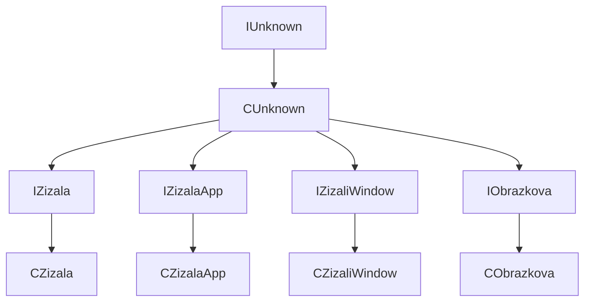

|               | VMT addr   | Constructor | VMs count | BCA                                              |
| ------------- | ---------- | ----------- | --------- | ------------------------------------------------ |
| IUnknown      | -          | -           |           | IUnknown                                         |
| CUnknown      | 0x004147A4 | 0x0040F030  | 4         | CUnknown, IUnknown                               |
| IZizala       | -          | -           |           | IZizala, CUnknown, IUnknown                      |
| CZizala       | 0x00414570 | 0x004010E0  | 14        | CZizala, IZizala, CUnknown, IUnknown             |
| IZizalaApp    | -          | -           |           | IZizalaApp, CUnknown, IUnknown                   |
| CZizalaApp    | 0x004145F8 | 0x00401A70  | 17        | CZizalaApp, IZizalaApp, CUnknown, IUnknown       |
| IZizaliWindow | -          | -           |           | IZizaliWindow, CUnknown, IUnknown                |
| CZizaliWindow | 0x00414678 | 0x00402220  | 6         | CZizaliWindow, IZizaliWindow, CUnknown, IUnknown |
| IObrazovka    | -          | -           |           | IObrazovka, CUnknown, IUnknown                   |
| CObrazovka    | 0x004146A4 | 0x00402900  | 10        | CObrazovka, IObrazovka, CUnknown, IUnknown       |

By comparing different BaseClassArrays I have been able to arrive to a following hierarchy by observing a change in BCA array for each listed class (there remain common BCA elements for the classes down the hierarchy).  However, I could not spot any strange parts in the induced hierarchy...

