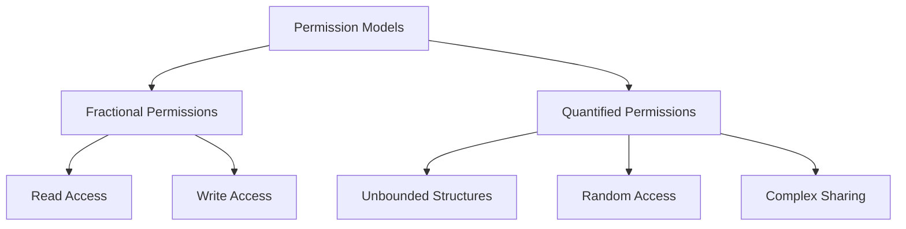

# Permission Models Notes

## Core Concepts and Motivation

### Why Advanced Permission Models?
Current permission model limitations when dealing with:
1. Dynamic data structures with complex sharing:
   > [!example] Problem Cases
   > - Doubly-linked lists (unclear who should hold field permissions)
   > - Random-access data structures
   > - Arbitrary cyclic data structures

2. Data structure traversals not following predicate definitions:
   - Iterative traversals where recursive predicates are cumbersome

## Two Advanced Permission Models

### 1. Fractional Permissions
- Allow splitting and re-combining permissions
- Permission amount π is a rational number in [0,1]
- Viper syntax:
  ```viper
  acc(t.f)         // shortcut for acc(t.f, write)
  acc(t.f, 1/2)    // half permission
  acc(t.f, write)  // full permission (1/1)
  acc(t.f, none)   // no permission (0/1)
  ```

> [!important] Permission Rules
> - Field read requires non-zero permission
> - Field write requires full (write) permission
> - Zero permission means no access

### 2. Quantified Permissions
- Allow permissions in universal quantifiers
- Useful for:
  - Unbounded data structures
  - Random access patterns
  - Complex sharing scenarios

```viper
// Example of quantified permission
forall x: Ref :: x in s ==> acc(x.f)
```

## Practical Applications

### Sharing in Data Structures

1. **Fractional Permissions for Sharing:**
```viper
predicate sharedCell(this: Ref) {
    acc(this.cell) && acc(this.cell.val, 1/2)
}
```

2. **Arrays Implementation:**
```viper
field val: Int // for integer arrays
domain Array {
    function loc(a: Array, i: Int): Ref
    function len(a: Array): Int
}
```

### Well-formed Quantified Permissions
> [!note] Key Rule
> For each assertion `acc(t.f)` under a `forall x:T`, t must be injective for all instantiations x1, x2:
> ```
> x1 != x2 ==> t[x ↦ x1] != t[x ↦ x2]
> ```

## Common Patterns and Best Practices

1. **For Reading Operations:**
   - Use fractional permissions (any non-zero amount)
   - Consider using wildcard permissions

2. **For Writing Operations:**
   - Require full permissions
   - Must handle permission recombination

3. **For Data Structures:**
   - Use quantified permissions for random access
   - Use fractional permissions for shared resources

## Advanced Features

### The Perm Type
```viper
field frac: Perm
method cloneList(this: Ref, p: Perm) returns (res: Ref)
    requires acc(list(this), p)
    ensures acc(list(this), p) && list(res)
```

### Arrays with Quantified Permissions
```viper
// Permission to all array elements
forall i: Int :: 0 <= i && i < len(a) ==> acc(loc(a, i).val)
```

> [!warning] Common Pitfalls
> - Trying to recombine wildcard permissions
> - Not handling permission fractions correctly in loops
> - Incorrect handling of shared mutable state

## Case Studies and Examples

### Binary Reference Counting Case Study

> [!note] Key Concepts
> - Optimizes code using immutable data
> - Tracks whether data is shared
> - Uses copy-on-write for shared data updates
> - Performs destructive updates on unshared data
> - Once shared, data doesn't return to unshared state

```viper
field data: Ref
field shared: Bool
field val: Seq[Int]

predicate segment(this: Ref) {
    acc(this.data) && 
    acc(this.data.shared, this.frac) && 
    acc(this.data.val, this.frac)
}
```

### Graph Marking Example

```viper
field next: Set[Ref]
field flag: Bool

define graph(nodes) (
    forall n: Ref :: n in nodes ==> 
        acc(n.next) && acc(n.flag) && 
        (n.next subset nodes)
)
```

> [!important] Features Demonstrated
> - Complex sharing patterns
> - Arbitrary traversal orders
> - Mutable state management
> - Permission tracking across data structure

## Implementation Details

### Adjusted Encoding for Permissions

1. **Permission Mask:**
```viper
type MaskType = Map<T>[(Ref, Field T), Real]
var Mask: MaskType
```

2. **Field Access Rules:**
```viper
// Read requires non-zero permission
assert Mask[x,f] > 0.0
v := Heap[x,f]

// Write requires full permission
assert Mask[x,f] == 1.0
Heap[x,f] := t
```

### Permission Operations

1. **Separating Conjunction:**
```viper
acc(x.f, 1/2) && acc(x.f, 1/2) 
// is equivalent to 
acc(x.f, 1/1)
```

2. **Permission Transfer:**
```viper
// inhale adds permissions
// exhale subtracts permissions and havocs only when all permission is removed
```

## Advanced Applications

### Working with Arrays

```viper
domain Array {
    function loc(a: Array, i: Int): Ref
    function len(a: Array): Int
    function first(r: Ref): Array
    function second(r: Ref): Int
    
    axiom injectivity {
        forall a: Array, i: Int :: {loc(a, i)}
        first(loc(a, i)) == a && second(loc(a, i)) == i
    }
}
```

### Two-Dimensional Arrays Extension

```viper
domain TwoDimArray {
    function loc(a: TwoDimArray, i: Int, j: Int): Ref
    function len1(a: TwoDimArray): Int
    function len2(a: TwoDimArray): Int
}

define array(a) (
    forall i: Int, j: Int :: 
        0 <= i && i < len1(a) && 
        0 <= j && j < len2(a) ==> 
        acc(loc(a, i, j).val)
)
```

## Key Takeaways

> [!summary] Important Points
> 1. Fractional permissions enable fine-grained access control
> 2. Quantified permissions complement recursive predicates
> 3. Advanced permission models solve complex sharing scenarios
> 4. Proper permission management is crucial for verification
> 5. Each model has specific use cases and trade-offs

## Exam Tips

> [!tip] For the Exam
> - Be able to explain why advanced permission models are needed
> - Understand the differences between fractional and quantified permissions
> - Know how to handle common data structures with both permission types
> - Be prepared to discuss permission-related verification challenges
> - Practice writing specifications using both permission models

## Key Definitions

1. **Fractional Permission**: A permission amount π that is a rational number in [0,1], used to distinguish between read and write access.

2. **Quantified Permission**: Permission specification using universal quantifiers, allowing permissions to an unbounded set of locations.

3. **Permission Mask**: A mapping that tracks permission amounts for each memory location.

4. **Well-formed Quantified Permission**: A permission specification where the receiver expressions are injective.

5. **Wildcard Permission**: A special permission amount that represents some unspecified, non-zero fraction.

Let's finish up with the final concepts from Module 11.

# More Advanced Permission Features and Extensions

## Array Operations Pattern
1. **Common Operations:**
```viper
// Basic array access pattern
method lookup(a: Array, i: Int) returns (res: Int)
    requires array(a) && 0 <= i && i < len(a)
    ensures array(a)
{
    res := loc(a, i).val
}
```

## Example: Binary Search Implementation with Permissions
```viper
method binarySearch(a: Array, v: Int) returns (index: Int)
    requires array(a) // Permission to whole array
    requires sorted(a) // Array must be sorted
    ensures array(a)
{
    var low: Int := 0
    var high: Int := len(a) - 1
    
    while (low <= high)
        invariant array(a)
        invariant 0 <= low && high < len(a)
    {
        var mid: Int := (low + high) / 2
        var elem: Int := loc(a, mid).val
        
        if (elem == v) {
            index := mid
            return
        } else if (elem < v) {
            low := mid + 1
        } else {
            high := mid - 1
        }
    }
    index := -1
}
```

## Advantages and Limitations

### Advantages
> [!success] Benefits
> - More expressive than basic permissions
> - Enables verification of complex data structures
> - Supports fine-grained access control
> - Allows modular verification
> - Can handle arbitrary sharing patterns

### Limitations
> [!warning] Challenges
> - Performance overhead in verification
> - Complexity in specifications
> - Requires careful management of permission fractions
> - Not all tools support advanced permission models
> - Quantified permissions can be tricky to get right

## Best Practices for Exam

> [!tip] Key Points to Remember
> 1. Always consider memory safety implications
> 2. Think about permission transfer in method specifications
> 3. Consider scenarios where sharing is required
> 4. Be able to explain why a particular permission model is chosen
> 5. Practice writing specifications with both models

## Common Exam Questions
1. Why are fractional permissions needed?
2. How do quantified permissions solve limitations of recursive predicates?
3. What is the difference between read and write permissions?
4. How to handle permission transfer in method calls?
5. When to use wildcards vs specific fractions?

## Summary of Permission Models


> [!note] Final Remarks
> The lecture covered two main advanced permission models that complement each other and provide solutions for various verification challenges. Understanding when and how to apply each model is crucial for successful program verification.

This completes the comprehensive notes for Module 11 on Permission Models. The material covers all the key concepts needed for the exam while providing practical examples and implementation details.