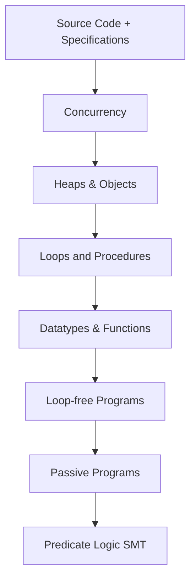

# Verification Methodologies - Exam Notes

## Core Components of Building an Automated Verifier

Inference rules determining execution relation

![[inference rules for execution relations.png]]

### 1. Key Components (Flow)
> [!info] Main Components
> - **Verification Problem** → **Formalization** → **Methodology** → **Automation**
> - Each step builds on the previous, creating a verification stack

### 2. Verification Stack Architecture


### 3. Key Concepts in IVL₀

> [!important] Core IVL₀ Commands
> - `Assert{f}` - Checks if formula holds, aborts if false
> - `Assume{f}` - Checks formula, discards execution if false
> - `c₁;c₂` - Sequential composition
> - `{c₁}[]{c₂}` - Nondeterministic choice

### 4. Correctness Types

> [!note] Three Types of Correctness:
> 1. **Functional Correctness**: Program respects pre/post conditions
> 2. **Safety**: No execution aborts with error
> 3. **Valid**: Both safe AND functionally correct

## Exam Tips for This Topic

Based on the exam guidelines:

1. **Know Your Code**:
   - Be prepared to explain verification rules and how they work
   - Understand why certain code verifies or doesn't verify
   - Be able to identify unsound encodings

2. **Key Areas to Focus**:
   ```markdown
   - Weakest precondition calculations
   - Program logic rules and their application
   - Sound vs unsound verification techniques
   - Error localization strategies
   ```

3. **Example Question Types**:
   > [!example] Common Questions
   > - Explain why a verification technique is sound/complete
   > - Analyze piece of Viper code
   > - Debug verification failures
   > - Design verification encoding for new construct

4. **Practical Skills**:
   - Practice working with Viper
   - Know how to encode verification problems
   - Understand error messages and debugging

## Common Pitfalls to Avoid

> [!warning] Watch Out For
> - Unsatisfiable axiom systems leading to unsoundness
> - Masked verification errors
> - Incorrect handling of nondeterministic choice
> - Missing safety checks
